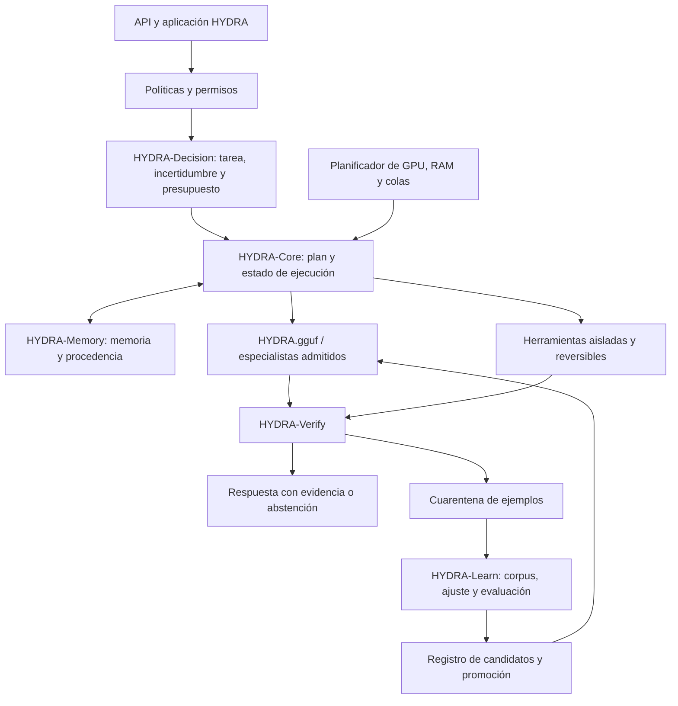

# Plan de implementación del motor propio HYDRA

Copyright (c) 2026 Luis Manuel Cousido Hermida. Todos los derechos reservados.

Fecha: 29/09/2026. Referencia local inspeccionada: `f8f1c6a`. Estado: plan de ejecución; no acredita tareas pendientes como realizadas. Este documento fija la dirección de producto acordada y prevalece sobre el enfoque anterior de simple agregación de proveedores. Los informes anteriores conservan su valor como evidencia histórica.

## 1. Resultado que vamos a construir

Un motor HYDRA propio, ejecutable localmente, que integre decisiones, planificación, herramientas, memoria, verificación, aprendizaje y gestión de recursos bajo contratos comunes. Adaptaremos componentes abiertos, técnicas documentadas y comportamientos útiles de otros sistemas cuando aporten una mejora comprobada. No existe un ganador universal por marca: cada capacidad se selecciona con tareas y mediciones propias.

El producto incluye un modelo HYDRA.gguf entrenado para su alcance, pero el motor no se reduce al archivo de pesos. Debe completar sus flujos esenciales sin APIs externas. Los servicios externos serán extensiones opcionales identificadas en cada ejecución, no requisitos ocultos.

Entregables de la primera versión aceptada:

- Motor instalable y API única, con modo local, registros y recuperación tras reinicio.
- HYDRA-Decision: decisiones tipadas, incertidumbre y abstención, con backend local validado.
- HYDRA.gguf versionado, acompañado de manifiesto, licencia, receta y evaluación independiente.
- Memoria persistente y verificadores propios, separados del conocimiento contenido en los pesos.
- Corpus HYDRA trazable, particiones congeladas y entrenamiento reproducible.
- Informes de calidad, recursos, estabilidad y rollback; instrucciones de instalación limpia.

No se afirmará que se han incorporado pesos o tecnología interna de sistemas cerrados. Las técnicas públicas pueden inspirar una implementación propia; reutilizar código, datos o pesos exige verificar sus condiciones concretas. Un componente basado en terceros conservará su procedencia.

## 2. Punto de partida y deuda inmediata

Ya existen core, router, planning, memory, tools, verification, corpus, training, model_factory y runtime. Se conservarán y consolidarán; crear otra implementación paralela del mismo concepto aumentaría la deuda. Hay cambios recientes de seguridad y rollback de parches en la rama local que deben formar parte de la base.

El GGUF piloto 1.5B está construido y sirvió una petición real del motor. Sus 64 casos sencillos empatan con la base: no demuestran especialización útil. Las 403 pruebas superadas y 5 omitidas corresponden a una validación anterior a algunos cambios recientes; el primer hito debe validar de nuevo el HEAD actual.

El cliente System One está implementado y probado con transporte simulado. La última instalación documentada de Kev usa PyTorch CPU: corregir CUDA y verificar inferencia real es trabajo pendiente, no capacidad disponible asumida. El plan de integración existente deja abierta la ejecución aislada de `python.test`; debe resolverse antes de aprender de ejecuciones de código.

## 3. Arquitectura de integración

Decision propone; Policy autoriza; Core ejecuta; Verify comprueba. Un modelo no podrá concederse permisos por devolver una probabilidad alta. Memory aporta información recuperable y borrable; Learn modifica pesos mediante versiones explícitas. Aprender no significa entrenar automáticamente con cada conversación.

Contratos mínimos versionados: DecisionRequest/Result, TaskPlan/StepResult, ToolInvocation/Receipt, MemoryEntry, VerificationEvidence, TrainingExample, ModelManifest. Cada contrato incluye identidad de versión, identificador de ejecución y estado explícito. Adaptar los contratos existentes cuando sea posible; evitar duplicar el kernel de `core` y `runtime`.

## 4. Qué investigar y adaptar de otros sistemas

Esta matriz expresa líneas de investigación, no capacidades exclusivas de una marca ni promesas de reproducción.

| Referencia | Aportación que evaluaremos | Destino HYDRA | Prueba decisiva |
|---|---|---|---|
| Jev / Kev | Decisiones tipadas, lectura paralela de preguntas y calibración | Decision | Error frente a cobertura, Brier y latencia sobre decisiones HYDRA |
| Qwen | Base generativa, programación y formatos estructurados | GGUF / Learn | Reparaciones ejecutables, JSON y español contra la base sin ajustar |
| DeepSeek | Entrenamiento con resultados verificables y razonamiento comprobable | Learn / Verify | Ganancia en problemas nuevos, coste y regresiones |
| Mistral | Eficiencia y comportamiento de especialistas abiertos seleccionados | Inference / Decision | Misma calidad con menor memoria o latencia en la carga objetivo |
| Kimi | Descomposición de tareas con herramientas y tratamiento de documentos | Core / Memory | Flujos largos completados, citas correctas y recuperación de fallos |
| ChatGPT y otros sistemas cerrados | Comportamientos públicos útiles: diálogo, uso de herramientas y experiencia integrada | Contratos y experiencia de HYDRA | Implementación propia que supera pruebas funcionales; sin presumir acceso al diseño interno |
| Runtimes y sistemas de agentes abiertos | Caché, batching, planificación de recursos, persistencia y observabilidad | Scheduler / Runtime | Perfilado, reinicio, aislamiento y prueba sostenida |

Para cada candidato se abrirá una ficha: problema, fuente/revisión/licencia, técnica o componente, módulos afectados, baseline, experimento, coste operativo, resultado y decisión. Estados: investigado, reproducido, adaptado, evaluado, integrado o descartado. Nada se denominará integrado por aparecer en YAML.

El documento anterior [plan multimodelo](PLAN_MAESTRO_HYDRA_MULTIMODELO.md) conserva las fuentes primarias de modelos y licencias. Volver a verificarlas al fijar cada versión. Kev-0.8B no será el router de herramientas por defecto: su checkpoint revisado advierte de limitaciones en esa tarea.

## 5. Backlog por fases

### P0 — Base reproducible y GPU

Tareas: registrar HEAD, dependencias y artefactos; ejecutar CI local apropiada y revisar CI remota actual; resolver el pendiente de `python.test` sin ejecutar código generado en el host; conservar rollback de parches. Sustituir PyTorch CPU por una distribución CUDA compatible únicamente en el entorno Kev, ajustar precisión, comprobar `torch.cuda.is_available()` y ejecutar inferencia real. Medir consumo antes de cargar generador y decisor juntos.

Entrega: `baseline-system.json`, inventario de versiones y recursos, informe de smoke CUDA/CPU y lista de incidencias. Salida: arranque reproducible del motor, código aislado, GPU comprobada y ninguna regresión crítica. Si Kev no es viable, mantener reglas/clasificador propio y registrar el motivo; no bloquear todo HYDRA por un proveedor.

### P1 — Núcleo y contratos propios

Avance 29/09/2026: observador local opcional conectado al router, contrato de
observación v1 y trazas integradas. Conserva íntegra la política y omite solicitudes
privadas, FAST o con presupuesto de latencia. Fallos y timeout no cambian la ruta;
cancelación y cierre del cliente probados. Véase `HYDRA_DECISION_LOCAL.md`.
Sigue pendiente el resto de P1, incluida abstención calibrada y validación real
del backend; este avance no acredita inferencia Kev ni mejora de HYDRA.gguf.

Tareas: mapear responsabilidades de core/runtime y eliminar duplicidades mediante adaptadores internos; unificar eventos, errores, cancelación, timeout, presupuesto y estado de tareas. Conectar Decision de manera consultiva, con fallback determinista y abstención. Política de red y permisos aplicada antes de cualquier ejecución.

Entrega: ADR de arquitectura, contratos versionados, pruebas de integración y trazas de tres flujos completos. Salida: una tarea puede seguirse desde entrada hasta evidencia final; reinicio y cancelación no dejan acciones ambiguas; ausencia de Kev no rompe el modo local.

### P2 — Banco de pruebas HYDRA independiente

Tareas: construir primero 200 casos de calibración y después un test v2 de 1.000 casos con al menos 100 por área principal. Cubrir programación, lógica, instrucciones/español, documentos, herramientas, memoria, incertidumbre y seguridad. Separar por repositorio, documento, plantilla y origen; congelar test antes del ajuste. Definir pesos por área y registrar errores de los oráculos.

Entrega: benchmark versionado, verificadores, baselines de reglas/modelo/motor, intervalos de confianza y catálogo de fallos. Salida: resultados reproducibles que distinguen mejoras reales de casos memorizados. Los 64 casos antiguos quedan como regresión histórica.

### P3 — Incorporación de capacidades al motor

Trabajar en cambios pequeños y comparables: planificación con pre/postcondiciones; herramientas idempotentes o reversibles; memoria con fuentes, caducidad y borrado; recuperación de documentos con citas comprobables; verificación independiente y estados passed/failed/unknown. La síntesis no debe alterar una respuesta verificada sin invalidar su evidencia.

Entrega: implementaciones propias y fichas de adaptación por capacidad. Salida: prueba A/B o ablación contra el baseline; conservar solo mejoras de calidad, fiabilidad o recursos que cumplan el presupuesto de la tarea. No usar un LLM como único juez de acciones ejecutables.

### P4 — Corpus propio y aprendizaje de decisiones

Tareas: terminar admisión con permisos y procedencia por fila; añadir negativos con evidencia explícita; separar datos sensibles y contenido no autorizado. Producir 2.000 ejemplos diversos y revisados antes de escalar a 10.000–30.000. Entrenar/calibrar el decisor con particiones distintas. Las pseudoetiquetas permanecen en cuarentena hasta verificarse.

Entrega: corpus v2 con manifiestos, estadísticas por familia, licencias, duplicados y resultados de calibración. Salida: 100% de ejemplos admitidos con permiso y evidencia exigidos para su uso; ninguna respuesta no verificada se convierte en verdad por confianza; test fuera del entrenamiento.

### P5 — Entrenamiento del modelo HYDRA

Tareas: comparar runs cortos 1.5B/3B; probar viabilidad de 7B solo después de perfilar memoria. Seleccionar la base por calidad y hardware. Ajuste supervisado por etapas con mezcla de capacidades para reducir olvido; preferencias únicamente cuando haya pares válidos. Dos semillas para el candidato final, parada por regresiones y evaluación de cada checkpoint relevante. Mantener entrenamiento de decisiones y generación separados si sus arquitecturas lo requieren.

Entrega: modelo fusionado, adaptadores, recetas, curvas de aprendizaje y comparación contra la base. Salida: mejora demostrada en el alcance fijado; si empata, no cambiar el nombre del resultado para aparentar progreso: revisar corpus, objetivo o base. No se plantea preentrenar un modelo de frontera desde cero en esta GPU.

### P6 — Inferencia, GGUF y memoria de ejecución

Tareas: comparar precisión del checkpoint y Q4_K_M/Q5_K_M; verificar tokenizer, plantillas, cabezas y formatos admitidos. No forzar un decisor tipo Kev al GGUF generativo si el runtime no soporta su arquitectura. Implementar presupuesto VRAM/RAM, descarga/carga de modelos, cola, límites de contexto y caché por identidad/configuración.

Entrega: paquete local reproducible con HYDRA.gguf y artefacto de decisión cuando corresponda. Salida: hashes y procedencia comprobados; medir degradación de cuantización y picos reales; sin descargas ni APIs externas ocultas durante el modo offline ya preparado.

### P7 — Aceptación, estabilidad y distribución

Tareas: pruebas diversas de 24 horas, al menos 1.000 tareas, aislamiento por usuario, borrado de memoria, caídas de procesos, timeouts y disco lleno. Instalación limpia Windows/Linux donde se declare soporte. Shadow/canary locales con rollback comprobado antes de promoción. Preparar PR con evidencia y CI sobre el HEAD que se publica.

Entrega: motor, modelo, ficha de límites, manual, informes y versión recuperable anterior. Salida: cumplir la matriz de aceptación siguiente. Publicar una versión del motor no implica aprobar automáticamente sus pesos.

## 6. Criterios de aceptación propuestos

Congelar estos criterios antes de la evaluación final; ajustar solo con una nueva versión explícita del protocolo. Son objetivos, no medidas ya obtenidas.

| Área | Criterio inicial |
|---|---|
| Modelo | Mejora agregada objetivo ≥5 puntos frente a la base, con intervalo pareado que respalde la mejora; ninguna área crítica cae >2 puntos |
| Motor | Mejora frente al mejor baseline simple en éxito de tareas o eficiencia, con calidad no inferior dentro del margen predefinido |
| Decisión | Brier/log-loss, ECE, cobertura/error y abstención en test; seleccionar umbral según coste del error, no un 0,9 universal |
| Herramientas | ≥99% de conformidad de esquema; cero acciones fuera de permisos en la batería definida; no confundir formato con ejecución correcta |
| Privacidad y memoria | Cero fugas en pruebas de aislamiento; borrado y fuentes comprobados; modo local sin solicitudes a proveedores |
| Rendimiento | Publicar p50/p95/p99, prompts diferentes, contexto, concurrencia y carga fría/caliente; objetivo inicial p95 TTFT caliente ≤2 s en tareas cortas |
| Recursos | Cero OOM en carga objetivo y margen VRAM objetivo del 15%; medir RAM y memoria del proceso separadas de la ocupación total del equipo |
| Cuantización | Pérdida agregada objetivo ≤1 punto respecto al checkpoint seleccionado; informar por área |
| Estabilidad | 24 h / ≥1.000 tareas, <1% errores inesperados, cero incidencias críticas abiertas y rollback demostrado |

“Completamente adiestrado” significa completar este programa y sus criterios para tareas declaradas. No significa conocimiento ilimitado ni ausencia de errores fuera de distribución.

## 7. Orden, estimación y control de alcance

Ruta crítica: **P0 → P1 → P2 → P3/P4 → P5 → P6 → P7**. La producción de datos puede avanzar tras fijar los contratos y el protocolo, pero no utilizar resultados del test para fabricar ejemplos de esa misma release.

Primera iteración, orden concreto:

1. Revalidar el HEAD actual y cerrar aislamiento de `python.test`.
2. Corregir CUDA de Kev y medir una decisión real con versión e identidad registradas.
3. Aprobar técnicamente los contratos comunes mediante pruebas; mantener reglas de seguridad fuera del modelo.
4. Construir los 200 casos de calibración y obtener baselines propios.
5. Elegir la primera capacidad externa que aporte mejora y adaptarla mediante un cambio acotado.

Estimación inicial de esfuerzo, no compromiso de calendario: P0 2–4 jornadas; P1 3–6; P2 5–10; P3 8–15; P4 8–15; P5/P6 5–12 más cómputo; P7 4–8 más la prueba sostenida. Reestimar al terminar P2: hay incertidumbre en calidad de datos, compatibilidad CUDA y capacidad del modelo. Un presupuesto cerrado sin esas medidas sería ficticio.

Usar primero el hardware disponible. Medir tokens por tarea, tasa de ejemplos admitidos, horas GPU, RAM/VRAM y almacenamiento. Cualquier necesidad de servicios de pago o hardware adicional se presenta con una estimación concreta antes de contratar. El plan no requiere usar todas las marcas: una referencia se descarta si no mejora el sistema o no puede incorporarse bajo condiciones adecuadas.

Cada fase termina con evidencia, commit/PR identificable y estado de sus pendientes. No fusionar cambios concurrentes sin revisar el nuevo HEAD; no reejecutar entrenamientos grandes por cambios puramente documentales. La integración a main sigue su procedimiento separado en `docs/MAIN_INTEGRATION_PLAN.md`; este plan no autoriza cambios de visibilidad, borrado de ramas ni compras.

## 8. Definición de terminado

Un usuario instala HYDRA, carga el paquete local, resuelve tareas del alcance acordado usando GPU cuando corresponde, puede inspeccionar decisiones y pruebas, conservar o borrar memoria, entrenar un candidato con datos permitidos y volver a la versión anterior. El sistema demuestra qué mejora respecto a su base, qué componentes procede de terceros y qué límites mantiene. Eso constituye un motor propio con capacidades integradas; una lista de modelos disponibles no basta.
