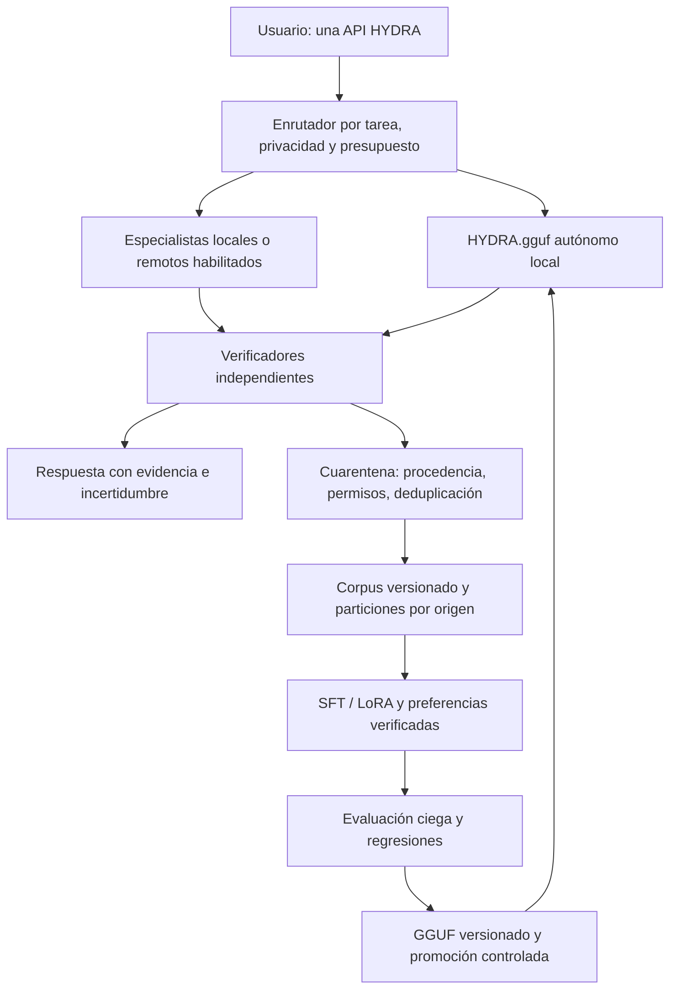

# Auditoría y plan maestro: motor HYDRA y modelo propio multimodelo

Copyright (c) 2026 Luis Manuel Cousido Hermida. Todos los derechos reservados.

Fecha: 29/09/2026. Código local auditado: `4af79e8`. Objetivo: un único producto HYDRA capaz de aprovechar especialistas y un HYDRA.gguf autónomo entrenado con conocimiento verificable y procedencia autorizada. Este documento es un plan; sus objetivos numéricos no son resultados obtenidos.

## Dictamen

La fábrica funciona: hay entrenamiento LoRA real, fusión, conversión, cuantización, identidad por hash e inferencia desde el motor. El modelo actual es Qwen2.5-Coder-1.5B-Instruct ajustado con 192 ejemplos sintéticos. No contiene una integración de pesos ni una destilación de Mistral, Kimi, DeepSeek, ChatGPT u otros profesores. El motor tiene selección, escalado y ensemble en código; no hay una evaluación integral que demuestre que combine esos proveedores con ventaja sobre un único modelo.

Los 64 casos de prueba solo cubren dos familias y los resuelven tanto la base como el candidato. No permiten elegir al mejor especialista ni medir especialización. Tampoco hay una prueba de estabilidad prolongada ni medición de pico de memoria. Cinco prompts repetidos y una petición al motor son comprobaciones útiles, no una certificación de producción.

“Completamente adiestrado” se definirá como completar el programa de entrenamiento y superar criterios de aceptación para un alcance declarado. No significa conocerlo todo, no equivocarse o heredar íntegramente las capacidades de todos los modelos.

## Evidencia y problemas prioritarios

| Área | Evidencia actual | Brecha / acción |
|---|---|---|
| Artefacto | GGUF 1.5B Q4_K_M, 986 MB; hash y procedencia en la ficha del piloto | Mantenerlo como control, no como producto general terminado |
| Calidad | Base 64/64 y candidato 64/64 | Nuevo benchmark independiente, más difícil y multidominio |
| Proveedores | `config/models.yaml` declara Qwen, Mistral y cloud; `models.hydra.yaml` solo usa hydra-local | Inventario de endpoints vivos, versiones y pruebas por capacidad; no usar puntuaciones iniciales como mediciones |
| Distilación P1 | `_ok` en `hydra/model_factory/distillation.py` acepta `verified=False` con confianza 0,9 y umbral 0,75; reproducido durante esta auditoría | Exigir evidencia positiva independientemente del umbral; pruebas de regresión antes de recolectar |
| Crítico P1 | `DatasetBuilder.critic` convierte ausencia/falsedad de `verified` en etiqueta fail | Separar passed, failed y unknown; solo passed/failed con verificador identificable producen etiquetas |
| Trazabilidad P1 | El exportador de destilación escribe mensajes sin identidad del profesor ni permiso de entrenamiento por fila | Incorporar metadatos y política de admisión obligatoria |
| Entrenamiento | LoRA probado; otros métodos aparecen en el Lab | Validar cada backend antes de prometer DPO, RL o entrenamiento completo |
| Memoria | RTX 3060 Ti de 8 GiB; piloto 1.5B entrenado | Medir picos reales y margen antes de elegir tamaño; no planificar todos los grandes modelos simultáneamente en esta GPU |
| GitHub | Remoto integration `500e991`, main `48d0f3a`, comprobados con git ls-remote | Las mejoras locales hasta `4af79e8` no están publicadas allí; falta CI remota de esta entrega |

Los problemas P1 anteriores están identificados, no corregidos por esta auditoría documental. Evidencias existentes: `docs/evidence/` y `docs/HYDRA_PILOT_MODEL_CARD.md`. Suite previa: 389 passed, 5 skipped; después se validaron por separado las dos pruebas nuevas de streaming y las pruebas relacionadas. No se vuelve a atribuir esa suite completa a cambios posteriores.

## Arquitectura del producto

Una sola interfaz y un modelo local por defecto son compatibles con especialistas opcionales. La modalidad autónoma debe funcionar sin API externa. La modalidad ampliada debe declarar cuándo consulta servicios externos, respetar privacidad y contabilizar coste.

La transferencia al modelo único se realizará mediante ejemplos y resultados verificados de profesores permitidos. No se sumarán ni concatenarán los pesos de arquitecturas y tokenizadores distintos. Un GGUF es un formato de distribución; convertir a GGUF no combina capacidades ni añade entrenamiento. Las fusiones de adaptadores compatibles pueden evaluarse, pero no son una fusión universal de marcas.

## Profesores y papel propuesto

Son hipótesis a evaluar, no rankings de marcas. Elegir versiones concretas y fijar revisión, licencia, tokenizer y hash antes de generar datos.

| Familia | Papel candidato | Condición de incorporación |
|---|---|---|
| Qwen | Código, salida estructurada, posible base del estudiante | Comparar modelos concretos; la base actual tiene licencia Apache 2.0 |
| Mistral | Instrucciones, herramientas y revisión alternativa | Seleccionar modelo concreto; las licencias varían dentro de la familia |
| DeepSeek | Problemas verificables de código y razonamiento | R1 permite destilación según su repositorio; revisar también la licencia de la base en variantes destiladas |
| Kimi | Tareas con herramientas y documentos | Fijar modelo y condiciones exactas; Kimi K2 publica licencia MIT modificada; no asumir viabilidad local de su modelo completo |
| ChatGPT / modelos OpenAI | Integración mediante API autorizada como especialista opcional | No existen pesos de ChatGPT aportados a este proyecto. No incluir sus salidas en destilación por defecto: verificar contrato y usos permitidos |
| Jev, TypeSafe AI | Decisiones tipadas, clasificación y enrutamiento probabilístico | Adaptador específico de decisión; acceso y condiciones por verificar. No asumir pesos disponibles ni exportación a GGUF |
| Kev, Jared Palmer | Backend local candidato para HYDRA-Decision | Evaluación por checkpoint y tarea; el 0.8B actual desaconseja tool-call routing. No sustituir reglas de autorización |
| Otros | Solo si aportan mejora medible | Mismo benchmark, procedencia y permisos; evitar ampliar por número de marcas |

Fuentes primarias consultadas para estas condiciones: [Qwen 1.5B](https://huggingface.co/Qwen/Qwen2.5-Coder-1.5B-Instruct), [licencias Mistral](https://help.mistral.ai/en/articles/347393-under-which-license-are-mistral-s-open-models-available), [DeepSeek-R1](https://github.com/deepseek-ai/DeepSeek-R1), [Kimi-K2](https://github.com/MoonshotAI/Kimi-K2), [acuerdo de servicios OpenAI](https://openai.com/policies/services-agreement/). Las condiciones de un repositorio abierto no se trasladan automáticamente a las de una API comercial. El acuerdo OpenAI contiene restricciones al uso de salidas para desarrollar modelos competidores, con excepciones definidas; no se presupone autorización general.

## Programa de ejecución y puertas de salida

| Fase | Entrega concreta | Criterio para avanzar |
|---|---|---|
| 0. Corregir admisión de datos | Verificación obligatoria; unknown separado de failed; identidad, permiso y evidencia por ejemplo | Ningún ejemplo no verificado o sin permiso entra al corpus de entrenamiento; regresiones automatizadas |
| 1. Benchmark HYDRA v2 | 1.000 tareas reservadas, al menos 100 por área principal; fixtures y verificadores versionados | Revisión de ambigüedades y fuga; fijar pesos, métricas y particiones antes del ajuste |
| 2. Motor de especialistas | Adaptadores y healthchecks por endpoint; routing medido; fallback, timeouts, cuotas y trazas | Cada proveedor supera contrato de integración; modo privado no envía datos a terceros; caída de un proveedor no bloquea la tarea |
| 3. Corpus HYDRA v2 | Primer lote de 2.000 ejemplos revisados; ampliar a 10.000–30.000 solo si aporta diversidad | 100% con fuente, verificador, versión, permisos y hash; deduplicación semántica y por origen; reservar test sin reutilizarlo |
| 4. Selección del estudiante | Comparar 1.5B/3B y viabilidad 7B mediante runs cortos | Elegir por calidad, memoria y latencia medidas; descartar OOM o degradaciones; fijar presupuesto antes de cómputo externo |
| 5. Adiestramiento | SFT por etapas, mezcla de tareas generales y especialistas; después preferencias si existen pares verificados | Dos semillas como mínimo para candidato final; validación intermedia; parada por regresión; reproducibilidad completa |
| 6. Exportación | Checkpoint fusionado y Q4_K_M/Q5_K_M con hashes, licencia y ficha | Medir pérdida frente al checkpoint; objetivo provisional ≤1 punto porcentual de pérdida agregada |
| 7. Calidad y estabilidad | Comparación base/estudiante/motor; pruebas de memoria, privacidad, herramientas y carga | Superar los criterios siguientes con informes completos, no con medias aisladas |
| 8. Release | CI Windows/Linux, instalación limpia, paquete motor y GGUF versionado, shadow/canary/rollback | Evidencia reproducible; ninguna incidencia crítica abierta; publicación de rama y revisión antes de main |

Las cantidades son objetivos iniciales de trabajo, no una garantía de rendimiento. El tamaño del corpus se ajustará por cobertura y curvas de aprendizaje, no por acumular variaciones de las mismas plantillas.

## Contenido y verificación del corpus

Áreas: programación y reparación de repositorios; matemáticas y lógica con solución comprobable; instrucciones en español; extracción y JSON; selección/uso de herramientas; preguntas sobre documentos con citas; memoria con actualización y borrado; privacidad y resistencia a instrucciones en documentos; incertidumbre y abstención; diálogo y planificación.

Cada fila: task_id, origen/licencia, revisión del profesor, prompt y respuesta, hashes, versión del verificador, resultado passed/failed/unknown, evidencia ejecutable, fecha, etiqueta de sensibilidad y partición. No copiar razonamientos internos privados. Para tareas objetivas usar tests, oráculos y esquemas; para tareas abiertas usar rúbrica y revisión humana muestreada. Un juez LLM puede ayudar a filtrar, pero su voto no sustituye pruebas de corrección ni permisos.

La separación será por repositorio/documento/plantilla/familia y, cuando proceda, por tiempo. Los 64 casos ya vistos permanecen como regresión histórica, no como nuevo test ciego. Ningún informe de test se recicla en entrenamiento de la misma versión que evalúa.

## Criterios propuestos de aceptación

- Calidad: mejora agregada objetivo ≥5 puntos porcentuales sobre la base elegida en el nuevo conjunto, con intervalo de confianza pareado; ninguna área crítica cae más de 2 puntos. Si no se cumple, no afirmar mejora y revisar datos o base.
- Herramientas/JSON: objetivo ≥99% de conformidad de esquema y cero acciones fuera de permisos en la batería adversarial definida.
- Privacidad/memoria: cero fugas en la batería; borrado y aislamiento entre usuarios comprobados. Diferenciar memoria externa del motor y conocimiento en pesos: el GGUF no reemplaza una base de memoria auditable.
- Rendimiento: publicar p50/p95/p99 de TTFT y latencia total, carga inicial y caliente, prompts distintos, longitud de contexto y concurrencia. Objetivo inicial local caliente p95 TTFT ≤2 s para tareas cortas; ajustar explícitamente si el hardware no lo permite.
- Memoria: muestrear GPU/RAM con herramienta y frecuencia declaradas; margen objetivo del 15% de VRAM en carga objetivo; no confundir memoria global ocupada con memoria del modelo. Cero OOM durante la prueba.
- Estabilidad: 24 horas y al menos 1.000 tareas diversas; registrar fallos, reintentos, colas y crecimiento de memoria. Objetivo de errores inesperados <1%; cero errores críticos pendientes.
- Publicación: comparación FP16/GGUF, hashes comprobados, reconstrucción documentada, licencia completa y rollback real a la versión anterior.

No existe “cero riesgo” por superar estas pruebas: las conclusiones se limitan al alcance evaluado. Los umbrales anteriores se congelarán antes de observar resultados finales para evitar ajustarlos a posteriori.

## Recursos y orden inmediato

Con la RTX 3060 Ti de 8 GiB se puede continuar el piloto pequeño y probar un 3B con perfilado. La viabilidad de un 7B con QLoRA depende de contexto, lote, offload y backend; no está demostrada aquí. Modelos grandes pueden actuar como profesores por lotes en infraestructura adecuada, sin mantenerlos todos en la GPU local. No se ha contratado ni presupuestado cómputo externo.

Primera iteración: corregir fase 0, construir 200 tareas de calibración separadas del test, probar los profesores realmente disponibles y seleccionar 2–3 por complementariedad medida. Segunda: congelar benchmark v2 y generar el primer lote de 2.000 ejemplos. Tercera: entrenar y comparar; ampliar solo cuando se vea ganancia y ausencia de regresiones. El coste se estimará con tokens por tarea, tasa de aceptación, horas GPU y almacenamiento medidos en esa calibración. No se promete plazo cerrado antes de conocer esas magnitudes.

Resultado final esperado: un motor único con capacidades auditables y un HYDRA.gguf autónomo especializado; especialistas externos opcionales amplían el sistema, pero sus capacidades no se atribuyen al GGUF cuando no estén demostradas en ejecución local.

## Actualización: integración de Jev / System One

Jev queda identificado como el modelo de decisión de TypeSafe AI. Su [documentación oficial](https://docs.typesafe.ai/introduction) describe preguntas tipadas sobre un estado y resultados con probabilidades: Choice, Score y Noul. No es un generador de conversación ni exclusivamente un clasificador binario. El [anuncio oficial](https://typesafe.ai/blog/introducing-system-one-models-and-jev) atribuye su entrenamiento a RLCD y publica comparaciones de velocidad y coste para determinadas tareas. Son resultados del proveedor, no medidas de HYDRA. La garantía de formato no implica que toda decisión sea semánticamente correcta.

La arquitectura objetivo incorpora una capa **HYDRA-Decision** anterior a la generación: clasifica tarea, propone especialista y decide abstenerse/escalar según probabilidades y coste del error. Jev será un backend opcional de esa capa. Las reglas de autorización, privacidad y acciones peligrosas seguirán siendo deterministas y no podrán ser anuladas por una puntuación del modelo.

Auditoría adicional del código: `CognitiveRouter._refine` llama hoy a `generate()` y analiza una respuesta JSON; no implementa una interfaz nativa de decisión. `hydra/training/specialists.py` sí contiene un clasificador local de regresión logística, pero no es Jev ni implementa RLCD. Además, si falta validación independiente, ese entrenador copia la precisión de entrenamiento a `valid_accuracy`: debe eliminarse esa sustitución antes de usar sus métricas como puerta de aprobación.

Orden de implementación de HYDRA-Decision:

1. Definir `DecisionProvider` separado de `ModelProvider.generate`: entrada de estado y preguntas tipadas; salida validada de opciones, probabilidades, identidad y latencia. Definir explícitamente preguntas independientes y exclusión mutua cuando corresponda.
2. Adaptar las reglas actuales y el clasificador local al contrato. Conservar un fallback offline determinista y abstención explícita. No llamar a una API externa en modo privado.
3. Crear particiones independientes de entrenamiento, calibración y test. Registrar Brier, log-loss, ECE, diagramas de fiabilidad, cobertura frente a error y matriz de confusión por dominio. Ajustar umbrales en calibración, nunca en test. Recalibrar ante cambio de distribución.
4. Integrar Jev solo tras verificar contrato de API, acceso y condiciones. Probar errores, timeout, opciones desconocidas, valores no finitos y normalización. No hay credenciales ni acceso a Jev comprobados en esta auditoría; no se han realizado llamadas de inferencia a ese servicio.
5. Comparar reglas, clasificador propio, Jev y router generativo sobre las mismas tareas y desde esta máquina: p50/p95, coste por decisión correcta, calibración, abstención y fallos de enrutamiento. Adoptar el backend por evidencia, no por cifras promocionales.
6. Entrenar HYDRA-Decision con etiquetas propias verificadas y, solo si se permite, resultados de profesores. Una implementación propia de clasificación calibrada no debe presentarse como réplica de RLCD ni como los pesos de Jev.

El producto seguirá siendo un motor único, pero su paquete podrá incluir `HYDRA.gguf`, un artefacto de decisión/calibración y la memoria externa. No se prometerá que un único archivo GGUF contenga servicios propietarios, memoria persistente y decisiones no generativas. El modo completamente local debe funcionar con los componentes propios; Jev y otros servicios amplían opcionalmente ese modo.

## Actualización: Kev y datos de decisión

Repositorio revisado: [jaredpalmer/kev](https://github.com/jaredpalmer/kev), HEAD observado `0c142becde423a0c68ec857f7831dac0315588a1`. El proyecto publica código Apache-2.0, modelos 0.8B/4B/9B/27B y compatibilidad con `/v1/systemone`. Sus checkpoints combinan adaptador LoRA y una cabeza de decisión; el servicio requiere también la base. Eso no acredita que sea una copia de los pesos o del entrenamiento interno de Jev. El coste cercano a un dólar corresponde a una ejecución de ajuste descrita por el autor, no al coste total de crear HYDRA. La compatibilidad de API debe probarse con nuestras preguntas y errores. [Repositorio y licencia](https://github.com/jaredpalmer/kev/blob/main/LICENSE).

La [ficha de Kev-0.8B](https://huggingface.co/jaredpalmer/kev-0.8b) documenta regresiones en When2Call y desaconseja el checkpoint actual para enrutamiento de herramientas. Describe datos de documentos, decisiones de desarrollo y ejemplos sintéticos con etiquetas calculadas; también advierte de límites de generalización. Es evidencia para seleccionar tareas, no para declarar que supera a Jev en general. El enlace histórico a 0.5B no debe usarse como identificador del modelo 0.8B actual.

Plan concreto para evaluarlo en la RTX 3060 Ti:

1. Mantener el entorno de Kev separado de `.venv` de HYDRA; fijar commit del código y revisiones completas de base/adaptador/calibración. No actualizar dependencias del modelo generativo para instalar un experimento de decisión.
2. Ensayar 0.8B únicamente en clasificación documental y categorías no críticas como prueba de instalación; contrastar 4B si el perfilado demuestra memoria suficiente. No afirmar que 4B cabe junto al generador en 8 GiB. Alternar cargas o usar CPU/otro equipo cuando las mediciones lo exijan.
3. Implementar el contrato DecisionProvider ya definido, con backend Kev localhost y fallback de reglas. Comprobar Choice/Noul/Score, abstención, timeouts, identidades y confidencias. Conservar políticas deterministas para herramientas y privacidad.
4. Evaluar primero sin ajustar: español, categorías HYDRA, ambigüedad, documentos largos, distribución desconocida y ataques de prompt. Congelar el test antes del ajuste. Comparar contra el clasificador propio y las reglas; Jev entra en la comparación solo si hay acceso autorizado.
5. Ajustar desde un checkpoint publicado compatible, usando train y calibración propios. Volver a medir la base y todas las tareas críticas para detectar olvido. Guardar el artefacto de decisión separado del GGUF generativo.

Inventario de datos propuesto:

| Fuente | Uso inicial | Condición de admisión |
|---|---|---|
| Tareas HYDRA con tests/oráculos | Entrenamiento y calibración, con particiones independientes | Solución reproducible y permiso documentado |
| Datasets y generadores referenciados por Kev | Candidatos a enriquecer el corpus de decisiones | Revisar licencia de cada dataset, versión, disponibilidad y procedencia de etiquetas; Apache del código no basta |
| Benchmarks públicos de Jev/Kev | Evaluación externa | Marcar eval-only; no entrenar con ellos y después anunciar generalización sobre esos mismos casos |
| Respuestas nuevas de Jev | Comparación; entrenamiento solo si está permitido | Registrar acceso, contrato, versión, consulta y uso autorizado; no presuponer acceso al corpus interno |
| Predicciones de Kev | Pseudoetiquetas en cuarentena | Contrastar con verdad de referencia; no convertir confianza alta en verificación |
| Tickets/documentos propios | Especialización de dominio | Permiso de uso, eliminación de datos sensibles y partición por origen |

La ejecución local debe verificarse con servidor en loopback, control de conexiones y políticas de registro; no equivale automáticamente a privacidad total. El criterio de selección será rendimiento y calibración en HYDRA, no similitud de nombre con Jev. Esta actualización no instala Kev, no descarga pesos y no incorpora datos de terceros: deja definida la integración y sus controles para la siguiente implementación.

### Avance de implementación posterior

El commit `9d01f91` incorpora el cliente local tipado y corrige la aceptación de respuestas no verificadas, las etiquetas negativas inferidas y la sustitución de validación por precisión de entrenamiento. Véase [estado técnico de HYDRA-Decision](HYDRA_DECISION_LOCAL.md). La política de permisos/procedencia por fila y la integración al router siguen pendientes. Se ha preparado un checkout Kev fijado y un entorno Python aislado; la preparación del entorno no acredita todavía un servidor listo ni inferencia verificada.
